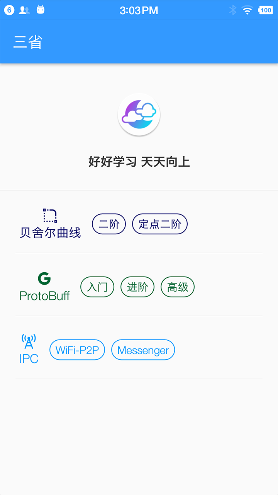

# DDU
good good study **好好学习**, day day up **天天向上**

### ScreenShot


### 主要功能点
- 绘制
  1. [x] 贝舍尔曲线
- 数据
  1. [x] `ProtoBuffer`
- IPC
  1. [x] `WifiDirect`: **P2P** & `Socket`
  2. [x] `Messenger`: `Service` & `BroadcastReceiver`
  3. [x] **LiveEventBus**: `LiveData` & `BroadcastReceiver`
  4. [x] **Bluetooth** `EasyPrinter` 

### 目录说明
```
.
├── LICENSE
├── README.md
├── app                --- 研究技术 demo
├── easyapi            --- 基于 LiveData & Retrofit
├── easylib            --- 通用方法
├── easyprinter        --- 蓝牙打印机
├── imessenger         --- 基于 Messenger 的 IPC 方案
├── local.properties
├── logic
├── mvvm               --- MVVM 生成插件
├── note
├── whisper            --- 基于 WiFi 跨进程、设备间传输
└── yi                 --- 基于 EasyApi MVVM demo
```