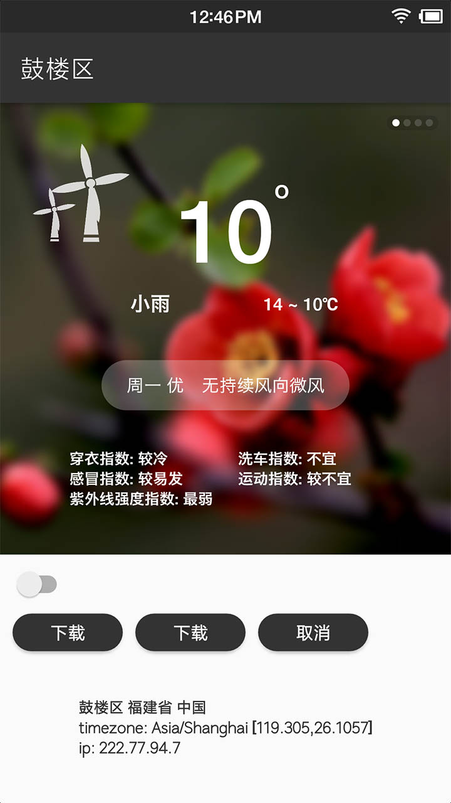

# Yi「易」

EasyApi Demo



## 目录结构

```
.
├── ReadMe.md               
├── art                     ---- 截图 
├── common                  ---- 公共模块
├── consume                 ---- 消费侧
├── im                      ---- IM
├── libs
├── live                    ---- 直播
├── produce                 ---- 生产侧       
├── proguard-rules.pro
├── src                     ---- 壳,整包编译
└── yi.iml

9 directories, 4 files
```

## 模块编译
在 `local.properties` 中添加如下字段

```
# 打包 consumer
consumer=true
# im 不参与编译,可独立运行
im=false
live=false
producer=true
```

## 说明
- 百度天气接口AK在根目录 `gradle.properties` 中,勿用于正式环境,勿频繁调用以免被封
- 申请百度开发接口AK [戳链接](http://lbsyun.baidu.com/apiconsole/key/create)